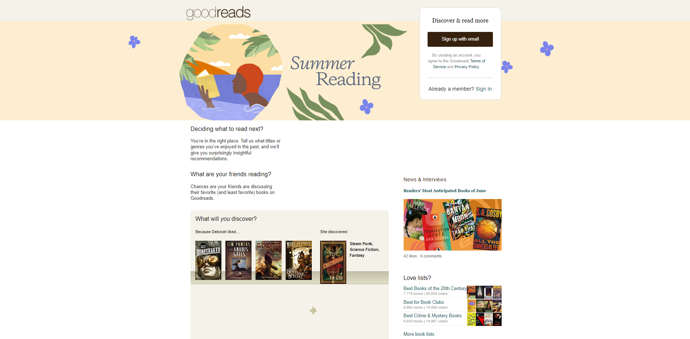
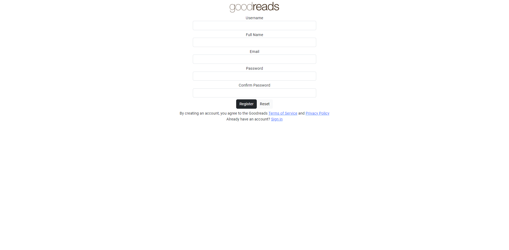
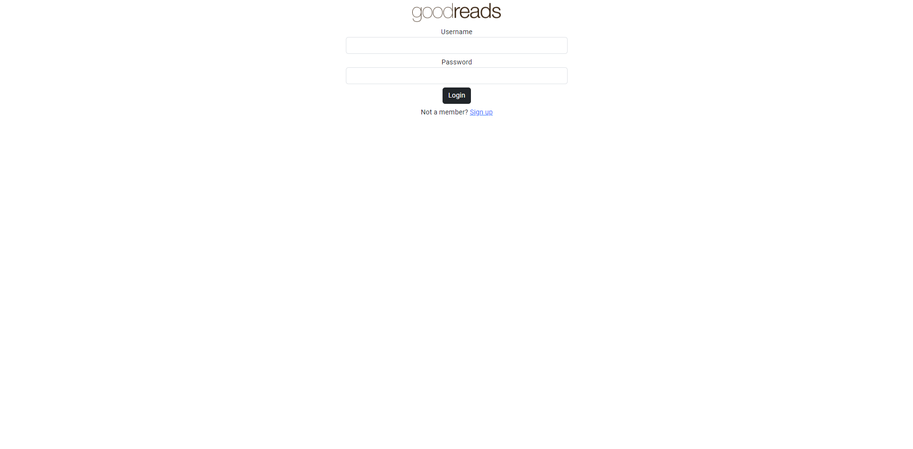
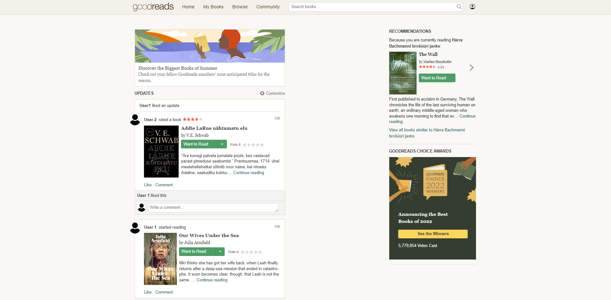

# GoodReads
This is a SDA JavaRemoteEE20 Final Project.

Simple book app where you can register a new user or log in and keep the information about the books you have read. You can write a review about the book and search for the books from the database. Registered user can also change their account settings and delete their user. 

## Table of Contents
* [General Info](#general-Info)
* [Technologies Used](#technologies-Used)
* [Features](#Features)
* [Screenshots](#Screenshots)
* [Setup](#Setup)
* [Project Status](#Project-Status)
* [Room for Improvement](#Room-For-Improvement)
* [Acknowledgements](#Aknowledments)
* [Contact](#Contact)

## General Info
* The purpose of this project was to use and demonstrate the knowledge learnt during SDA Java course.
* The project had to have some basic functionalities (e.g register new users, log in, log out, delete user).
* The project enables the users to register themselves to the app and get some basic information about the previously added books from the database and add some comments or previews by themselves. The users can also log out from the app and delete their user.  
* The application should be easy to run without any upcoming errors. 

## Technologies Used
This project was built using [spring initializr](https://start.spring.io) and uses the following technologies:

* Java 17 
* Maven
* Spring Boot - backend
* Hibernate
* REST API
* Angular CLI, Bootstrap - frontend
* MySQL - database
* Spring Security
* Spring Data JPA
* Draw.io - for the [ERD](https://drive.google.com/file/d/1A95UXY03f-CaZECtrt-oUqNlbBrbDZC9/view?usp=sharing)
* Draw.io - for the [Process flow](https://app.diagrams.net/#G1sHhX79DltTUmBxDNl2SsPq4a_5PYhpnC)

## Features

* Register 
* Login/log out
* User CRUD operations

## Screenshots
* Home view

* Register

* Login

* Signed-in view

* User settings view

## Setup

Dependencies (added in Spring initializr using Maven) used: 
* Lombok
* Spring Boot DevTools
* Spring Web
* Spring Security
* Spring Data JPA
* MySQL Driver

To run the application it is required to initialize the MySQL database, please run the db_sql.sql file.

## Project Status
Project is: in progress

## Room for Improvement
Room for improvement:

* Unit tests. 
* Additional functionalities for registered users.
* Additional functionalities for home page.
* Adding the book API connection. 
* Making the code lighter - improve the classes and interactions, deleting comments, adding functionalities and interactions. 
* Improving frontend. 

## Acknowledgements
* This project was inspired by [GoodReads](https://www.goodreads.com) web application. 
* Many thanks to [SDA](https://shorturl.at/hkU26) and its lecturers.

## Contact
Created by [@esaikovski](https://github.com/esaikovski) and [@kerlikasar](https://github.com/kerlikasar)

